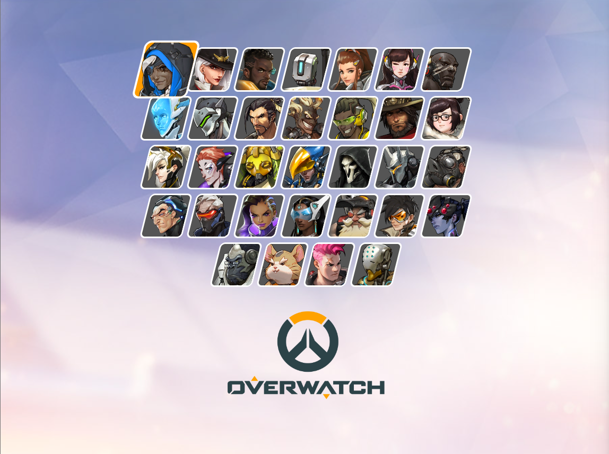

# Overwatch Hero Gallery

이 프로젝트는 HTML과 CSS를 사용하여 오버워치(Overwatch) 영웅들의 목록과 로고를 표시하는 웹 페이지입니다.

## 프로젝트 소개

오버워치 영웅들을 카드 형태의 그리드로 나열하고, 하단에 공식 로고를 배치하는 레이아웃을 구현했습니다. `reset-css`를 사용하여 브라우저 기본 스타일을 초기화하고, 커스텀 스타일(`main.css`)을 적용할 수 있도록 구성되어 있습니다.

## 주요 기능

- **영웅 목록 표시**: `.heroes` 컨테이너 내에 다수의 `.hero` 요소를 배치하여 영웅 이미지를 담을 수 있는 구조를 마련했습니다.
- **스타일 초기화**: JSDelivr CDN을 통해 `reset-css` 라이브러리를 적용했습니다.
- **로고 배치**: 페이지 하단에 오버워치 로고 이미지를 표시합니다.

## 기술 스택

- **HTML5**: 웹 페이지 구조 작성
- **CSS**: 스타일링 (`main.css` 파일 참조)

## 실행 방법

웹 브라우저에서 `index.html` 파일을 열어 실행합니다.
