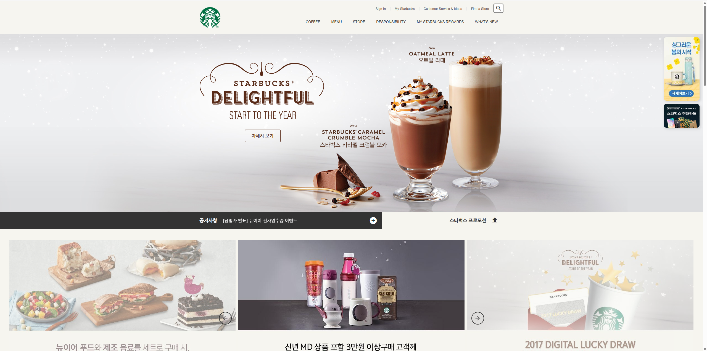

# Starbucks

## ☕ 프로젝트 소개

이 프로젝트는 스타벅스(Starbucks) 웹사이트를 주제로 한 웹 개발 프로젝트입니다. 사용자에게 친숙한 UI/UX를 제공하며 스타벅스의 브랜드 이미지를 웹으로 구현하였습니다.

> **Note**: 실제 구현된 기능과 내용에 맞춰 아래 항목들을 수정해 주세요.

## 📸 스크린샷 (Screenshots)

### 메인페이지



### 로그인페이지


## � 기술 스택 (Tech Stack)

이 프로젝트는 다음의 기술들을 사용하여 제작되었습니다.

- **HTML5**: 웹 페이지 구조 설계
- **CSS3**: 스타일링 및 레이아웃 구성
- **JavaScript**: 동적인 기능 및 인터랙션 구현
<!-- 필요한 경우 추가: SCSS, React, Vue, Node.js 등 -->

## ✨ 주요 기능 (Key Features)

- **메인 페이지**: 스타벅스 메인 랜딩 페이지 구현
- **네비게이션 바**: 드롭다운 메뉴 및 반응형 헤더
- **비주얼 효과**: 요소 등장 애니메이션 및 슬라이드 효과
- **반응형 웹**: 데스크탑 및 모바일 환경 지원

## 📂 폴더 구조 (Directory Structure)

```bash
starbucks/
├── index.html      # 메인 페이지
├── css/            # 스타일시트 폴더
│   └── main.css
├── js/             # 자바스크립트 폴더
│   └── main.js
└── images/         # 이미지 리소스 폴더
```

## 🚀 시작 가이드 (Getting Started)

프로젝트를 로컬 환경에서 실행하는 방법입니다.

1. 저장소를 클론합니다.
   ```bash
   git clone https://github.com/jhseo/starbucks.git
   ```
2. 프로젝트 디렉토리로 이동합니다.
   ```bash
   cd starbucks
   ```
3. `index.html` 파일을 브라우저(Chrome, Edge 등)에서 실행합니다.
